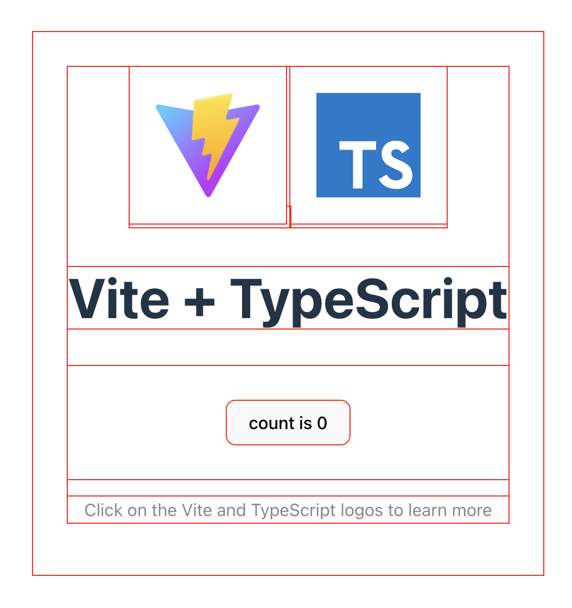
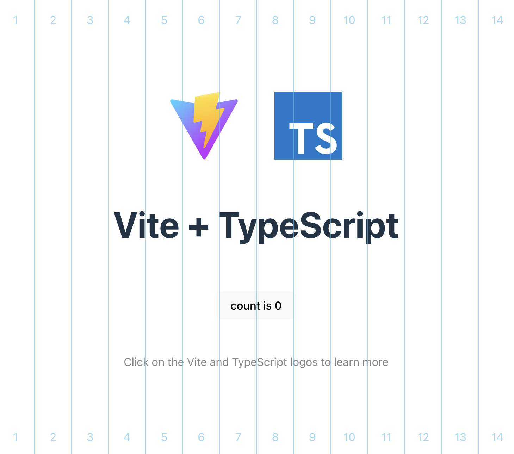

# Nuxt Layout Aid

A dead-simple Nuxt plugin that adds visual layout aid for integrating web pages.

> During build, this module will be an empty string, making it dev-only.

Try this module on [StackBlitz](https://stackblitz.com/edit/nuxt-starter-g2dehnh1?embed=1&file=app.vue) (use `ctrl/cmd` + `o` and `ctrl/cmd` + `g`).

## Installation

npm

```bash
npm i -D @layoutaid/nuxt
```

pnpm

```bash
pnpm add -D @layoutaid/nuxt
```

yarn

```bash
yarn add -D @layoutaid/nuxt
```

In `nuxt.config.ts`

```typescript
export default defineNuxtConfig({
    modules: ['@layoutaid/nuxt'],
    layoutAid: {
        // Config goes here
    },
})
```

## Features & options

### Outline

Shows an outline around each element. Enable/disable with hotkey: `ctrl` + `o`



Customizable options:

```typescript
// In Nuxt config
export default defineNuxtConfig({
    modules: ['@layoutaid/nuxt'],
    layoutAid: {
        outline: {
            color: 'red', // The color of the outlines
            persist: true, // Enable persistence between reloads.
        },
    }
})
```
Use `outline: false` to completely disable this feature.

### Columns

Shows column guides. Enable/disable with hotkey: `ctrl` + `g`



Customizable options:

```typescript
// In Nuxt config
export default defineNuxtConfig({
    modules: ['@layoutaid/nuxt'],
    layoutAid: {
        color: 'rgba(85, 189, 234, 0.6)', // The color of the column guides
        count: 14, // The number of columns
        persist: true, // Enable persistence between reloads
    }
})
```
Use `outline: false` to completely disable this feature.

## Show in prod

If for some reason you need the modules enabled in production build, use `prod: true`:

```typescript
// In Nuxt config
export default defineNuxtConfig({
    modules: ['@layoutaid/nuxt'],
    layoutAid: {
        prod: true,
    }
})
```
