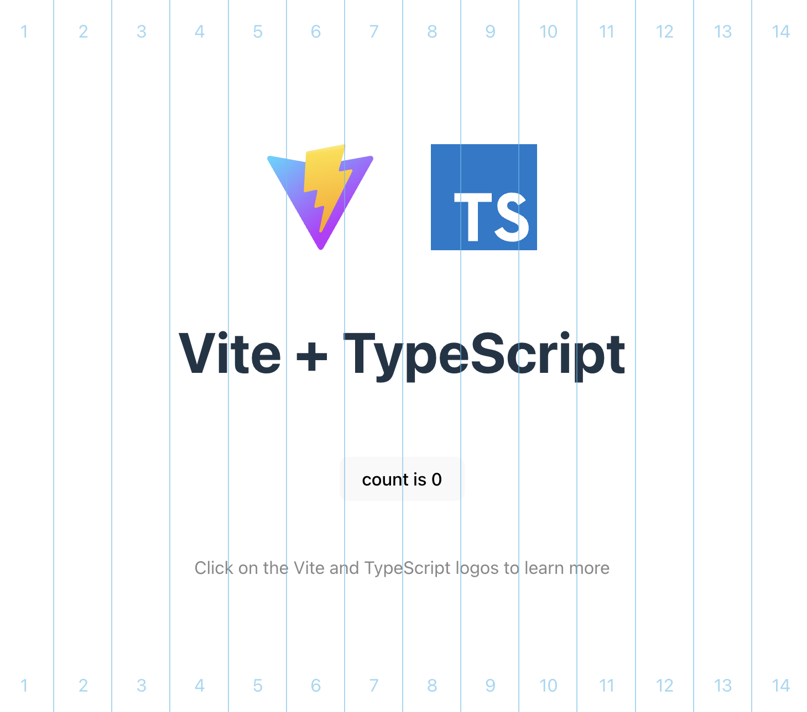

# Vite Plugin Layout Aid

A dead-simple Vite plugin that adds visual layout aid for integrating web pages.

> During build, this module will be an empty string, making it dev-only.

## Installation

npm

```bash
npm i -D vite-plugin-layoutaid
```

pnpm

```bash
pnpm add -D vite-plugin-layoutaid
```

yarn

```bash
yarn add -D vite-plugin-layoutaid
```

In `vite.config.ts`

```typescript
import layoutAid from 'vite-plugin-layoutaid'

export default defineConfig({
    // ...
    plugins: [
        layoutAid(),
    ],
    // ...
})
```

## Features & options

### Outline

Shows an outline around each element. Enable/disable with hotkey: `ctrl` + `o`


Customizable options:

```typescript
// In Vite config
plugins: [
    layoutAid({
        outline: {
            color: 'red', // The color of the outlines
            persist: true, // Enable persistence between reloads.
        },
    }),
]
```
Use `outline: false` to completely disable this feature.

### Columns

Shows column guides. Enable/disable with hotkey: `ctrl` + `g`



Customizable options:

```typescript
// In Vite config
plugins: [
    layoutAid({
        columns: {
            color: 'rgba(85, 189, 234, 0.6)', // The color of the column guides
            count: 14, // The number of columns
            persist: true, // Enable persistence between reloads
        },
    }),
]
```
Use `outline: false` to completely disable this feature.

## Show in prod

If for some reason you need the modules enabled in production build, use `prod: true`:

```typescript
layoutAid({
    prod: true,
})
```
